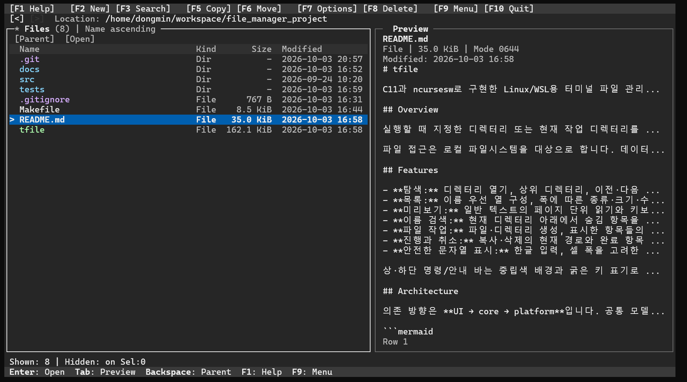
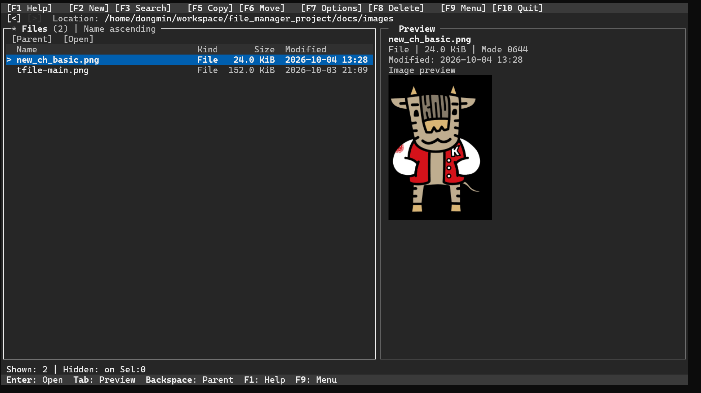
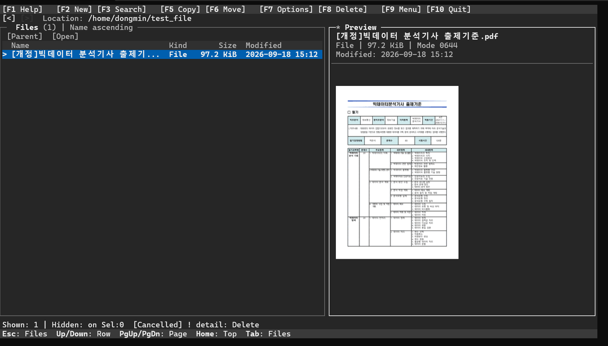
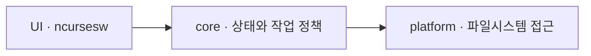

# tfile

C11과 ncursesw로 만든 **Linux/WSL용 터미널 파일 관리자**입니다. 파일 목록과 텍스트·선택적 이미지/PDF 미리보기를 함께 보면서 키보드와 마우스로 탐색·검색·복사·이동·삭제할 수 있습니다.



기본 화면은 목록+미리보기이며 `F9`에서 목록만 보기 또는 좌우 파일 목록을 선택할 수 있습니다. `Tab`으로 목록↔미리보기 또는 좌우 파일 목록 사이를 이동합니다. 하단에는 표시 항목 수, 숨김 표시 설정, 작업 대상 선택 수와 현재 초점에 맞는 단축키가 표시됩니다.

이미지 파일을 선택하면 오른쪽 미리보기 패널에서 사진도 바로 확인할 수 있습니다. 아래는 PNG 이미지를 미리보는 실제 실행 화면입니다. 이미지 미리보기에는 Sixel을 지원하는 터미널과 선택적 변환 도구가 필요하며, 설정 방법은 [선택적 이미지·PDF 미리보기](#선택적-이미지pdf-미리보기-1단계)를 참고하세요.



PDF 파일도 오른쪽 미리보기 패널에서 **첫 페이지**를 이미지로 확인할 수 있습니다. 아래는 PDF 문서를 미리보는 실제 실행 화면입니다. PDF 이미지 미리보기에는 Sixel을 지원하는 터미널과 ImageMagick, Poppler의 `pdftoppm`이 필요합니다. 이미지 표시가 불가능한 경우에는 `pdftotext`를 사용할 수 있으면 첫 페이지 텍스트로 전환합니다.



## 주요 기능

- **탐색:** 디렉터리 열기, 상위 디렉터리 이동, 이전·다음 방문 위치와 커서·스크롤 복원.
- **이중 패널:** 좌우 독립 탐색·정렬·숨김·선택·방문 기록. 좁은 화면에서는 활성 목록을 전체 폭으로 표시.
- **목록:** 이름·크기·수정일·종류 정렬, 숨김 표시, 커서와 구분되는 다중 선택 표시.
- **미리보기:** 일반 텍스트 페이지·스크롤·빈 파일/디렉터리 안내. 선택적으로 PNG/JPEG와 PDF 첫 페이지를 Sixel로 표시. 비동기 변환·선택별 캐시·리소스 상한 유지.
- **검색:** 현재 목록 빠른 찾기와 하위 디렉터리의 이름 검색.
- **파일 작업:** 파일·디렉터리 생성, 단일 이름 변경, 단일·일괄 복사·이동·삭제.
- **진행과 결과:** 복사·삭제 취소, 대상별 결과와 부분 처리 정보, 목록 갱신 결과를 구분하는 최근 작업 상세.
- **안전한 표시:** 한글과 셀 너비를 고려하고 제어문자·잘못된 UTF-8을 이스케이프. 실제 작업에는 원본 파일명 바이트 사용.

## 빌드 및 실행

필요한 환경은 Linux/WSL, C11 컴파일러, `make`, ncursesw 개발 라이브러리입니다. UTF-8 로캘과 마우스 입력을 지원하는 터미널을 권장합니다. 테스트에는 Python 3도 필요합니다.

```sh
make
./tfile
# 시작할 디렉터리를 지정할 수도 있습니다.
./tfile /path/to/directory
```

최소 화면 크기는 **50열 × 9행**, 권장 크기는 **100열 × 24행**입니다. 작은 화면에서는 상단 명령을 축약하며 `F9` 메뉴에서 전체 이름을 확인할 수 있습니다.

## 선택적 이미지·PDF 미리보기 (1단계)

PNG/JPEG 이미지와 PDF **첫 페이지**를 기존 미리보기 안에 종횡비를 유지해 표시합니다. 이미지 파일은 확대하지 않으며 파일명·종류·크기·수정 시각과 로딩·오류 안내를 유지합니다. PNG/JPEG/PDF는 일반 파일의 실제 헤더로 구분합니다. 확장자가 `.png`여도 내용이 일반 텍스트이면 기존 텍스트 미리보기를 사용하며, 0바이트 파일과 디렉터리·링크·특수 파일을 변환기에 보내지 않습니다.

선택 의존성은 **ImageMagick 6의 `convert` 또는 7의 `magick`** (PNG/JPEG 읽기·SIXEL 쓰기 coder 포함), PDF용 **Poppler의 `pdftoppm`**입니다. PDF 텍스트 대체에는 같은 패키지의 `pdftotext`를 사용합니다. 빌드에 이 도구들의 개발 헤더나 링크 라이브러리를 추가할 필요가 없고, 도구가 없어도 기본 파일 관리는 실행됩니다. Linux 도구만 사용하며 Windows API·PowerShell·Windows 실행 프로그램에 의존하지 않습니다.

Ubuntu/WSL의 Ubuntu에서는 선택적으로 설치합니다.

```sh
sudo apt install imagemagick poppler-utils
```

일반 사용자는 환경변수 없이 `./tfile`을 실행하고 PNG/JPEG/PDF를 선택하면 됩니다. 기본 **Auto**는 이미지가 들어갈 수 있는 미리보기 패널에서 처음 미디어가 필요할 때 DA의 Sixel 지원 응답과 `CSI 16 t` 셀 픽셀 크기를 자동 조회합니다. 유효한 현재 ioctl 셀 정보도 사용합니다. 최대 **700 ms** 동안 비차단으로 응답을 기다리며 탐색·빠른 찾기·키보드·마우스 입력을 유지합니다. 지원 응답과 유효한 셀 크기(폭 1–64, 높이 1–128)를 얻으면 별도 환경변수나 시각 확인 질문 없이 현재 세션의 미리보기를 활성화합니다. `TERM`·Linux/WSL 여부 자체는 지원 근거로 사용하지 않습니다.

지원 응답은 터미널의 기능 선언이며 **실제 픽셀 렌더링·삭제의 완전한 검증이 아닙니다**. 변환 도구의 설치와 PNG/JPEG/PDF coder 지원도 별도 조건입니다. 지원 여부와 셀 크기는 설정 파일에 저장하지 않고 현재 실행 안에서 재사용하므로 파일마다 조회하지 않습니다. 창 크기 변경은 이미지 배치를 다시 계산합니다. 자동으로 얻은 셀 크기는 현재 ioctl 정보로 갱신하고, 유효한 ioctl 정보가 없으면 필요한 미디어에서 셀 크기만 최대 700 ms 다시 조회합니다. F7 또는 환경변수로 명시한 측정값은 리사이즈에도 유지하며 폰트·배율 변경 시 사용자가 F7에서 다시 확인합니다.

무응답·유효하지 않은 응답은 지원 미확인, Sixel 없는 유효한 DA는 미지원, 셀 크기 누락은 크기 미확인으로 구분합니다. 실패하면 이유와 **F7: image setup**을 짧게 표시하며 파일 변경·새로고침마다 재시도하거나 팝업을 띄우지 않습니다. PDF는 가능한 경우 첫 페이지 텍스트로 전환합니다. 도구 누락은 터미널 상태와 별도의 오류로 표시합니다. 감지 중 모달을 열거나 화면을 이미지가 들어가지 못할 만큼 줄이면 감지를 취소하고 늦은 응답은 소비만 합니다. F7에서 명시적으로 재시도할 수 있고, Off → Auto 전환도 실패한 감지를 다시 요청합니다. 선택 변경은 세션 감지를 유지하되 현재 선택만 변환하며, 모달·작은 화면·종료에서는 변환 자식과 이전 이미지의 기존 취소·회수·지우기 경로를 사용합니다.

**F7 → Image display setup**은 자동 감지가 실패하거나 배치·표시·지우기가 잘못될 때 사용하는 복구 및 육안 진단 수단입니다. 상태는 Unconfirmed(아직 감지 안 함), Checking, Enabled, Off, No support response, No Sixel support, Cell size unknown, Query failed/cancelled로 구분합니다. 진단 첫 화면은 `magick`/`convert`, `pdftoppm`, `pdftotext`의 발견 여부를 터미널 상태와 따로 표시합니다. 발견은 실행 가능 파일이 있다는 뜻이며 coder 지원이나 실제 변환 성공을 보장하지 않습니다. 필요한 패키지는 사용자가 설치하며 앱이 설치나 sudo를 실행하지 않습니다.

1. **Enter**로 명시적으로 확인을 시작합니다. 진행 중인 변환은 기존 비차단 취소·회수 경로로 정리합니다(최대 1초 후 재시도 안내). DA의 Sixel 기능 응답과 `CSI 16 t`의 셀 크기를 최대 700 ms 동안 질의하며, 유효한 현재 ioctl 셀 정보도 활용합니다. 이 명시적 진단에서만 테스트 이미지를 출력합니다. `TERM`·Windows/WSL 여부는 지원 근거로 사용하지 않습니다.
2. 지원 응답과 셀 크기를 얻으면 **외부 도구 없이 고정된 작은 빨강/파랑 이미지**를 표시합니다. 이미지가 `|` 표시 사이와 지정된 영역 안에 보이는지 확인하고 `y`를 누릅니다. 없거나 영역을 벗어나면 `n` 또는 Esc로 취소합니다.
3. 이미지를 지운 뒤 **실제로 사라졌는지 별도 질문**에 답합니다. 잔상이 있으면 `n`으로 취소합니다. PTY 검사는 픽셀 표시·지우기를 육안으로 검증한 결과가 아닙니다.
4. 두 확인 후 **Enable image preview for this session?**에서 `y`를 선택해야 현재 실행의 셀 크기·지원 상태와 Auto를 적용합니다. PNG/JPEG/PDF 첫 페이지의 실제 변환 성공은 이 터미널 확인과 별개입니다. 취소·실패는 이전 유효한 값을 보존합니다. 리사이즈는 테스트를 지우고 오래된 팝업을 닫으며 F7 재확인을 안내합니다.

응답이 없거나 올바르지 않으면 **자동 확인을 못한 것**이며 “지원하지 않음”으로 단정하지 않습니다. 셀 크기를 추측하거나 10×20 같은 기본값을 사용하지 않습니다. 고급 수동 확인은 **M**에서 실제 측정한 `WIDTHxHEIGHT`(폭 1–64, 높이 1–128)를 입력합니다. 응답하지 않는 터미널도 수동 표시·지우기 검증을 시도할 수 있지만 같은 세 단계 확인을 통과해야 적용됩니다. 폰트·배율을 바꾸면 F7에서 다시 확인하세요.

자동 또는 F7 질의 후 입력 필터는 실행 종료까지 유지됩니다. 7비트 CSI와 8비트 CSI 응답을 일반 UTF-8 문자와 구분합니다. 응답은 최대 128바이트, 각 숫자 5자리, DA 최대 32개 필드로 검증하며 부분 응답은 입력 호출·팝업 종료·타임아웃을 넘어 보관합니다. 정상 응답과 잘못된 보고서의 본문은 일반 단축키로 실행하지 않습니다. 제한 시간이 지난 자동 감지나 취소한 질의의 늦은 완전한 응답도 소비하며 해당 후보에는 적용하지 않습니다. 일반 키·Unicode·마우스는 프레임 밖에서 그대로 처리하고, 진단 중 일반 키는 그 모달에만 속합니다. 입력을 일괄 flush하거나 tty 모드를 바꾸지 않습니다. ESC 단독과 응답 시작의 구별에는 질의 중 최대 100 ms(그 밖에는 25 ms)의 대기 여유를 둡니다. ESC 하나만 아주 느리게 도착하면 취소로 처리될 수 있지만 뒤의 응답은 여전히 필터링합니다. 완결된 일반 미등록 CSI와 숫자 매개변수 뒤 `~`로 끝난 CSI는 종료 문자에서 버리고 다음 일반 입력을 처리합니다. DA(`ESC[?`), 셀 보고서(`ESC[6;`), `?`가 누락된 흔한 DA 형태(`ESC[62;`)는 잘못된 본문도 해당 종료 문자(c/t)까지 격리합니다. 끝나지 않은 보고서는 Esc로 취소해도 본문을 재생하지 않으며, 종료 문자 또는 새 `ESC [`/`ESC O` 또는 8비트 CSI 프레임에서 복구합니다. 그 전에는 응답 꼬리와 구별할 수 없는 일반 문자가 소비될 수 있습니다. 그 밖의 표식 없는 잘못된 응답은 보고서로 추정하지 않습니다. 새 제어 프레임은 응답과 사용자 입력의 재동기화 경계입니다. 이 경계를 가로질러 나중에 분리된 꼬리나 임의의 표식 없는 잘못된 바이트까지 완벽히 구별할 수는 없습니다. 불완전한 응답 뒤 일반 문자가 소비되면 방향키·F7 등 새 제어 프레임으로 복구할 수 있습니다. 단독 Esc 전달 뒤나 UTF-8 일부를 보관한 무입력 상태는 원래 blocking 대기로 돌아갑니다. Esc·리사이즈·SIGINT 종료는 계속 처리합니다.

이 확인 결과와 셀 크기는 **현재 실행에만 유지**됩니다. 확인 성공만으로 설정 파일에 기록하지 않습니다. 일반 설정에는 기존처럼 사용자가 F7의 시작 기본값 저장을 선택했을 때 Auto/Off만 저장하며, 다음 실행의 터미널 지원까지 확정하지 않습니다. 터미널별 영구 프로필은 제공하지 않습니다.

고급 사용자는 기존 환경변수 방식도 사용할 수 있습니다. **실제로 측정하고 표시·지우기를 확인한 값일 때만** 예를 들어 다음과 같이 실행합니다.

```sh
TFILE_SIXEL=1 TFILE_CELL_PIXELS=8x16 ./tfile /path/to/files
```

`TFILE_SIXEL=1`은 사용자의 지원 확인 선언이며 `TFILE_CELL_PIXELS` 또는 유효한 ioctl 정보가 있어야 적용됩니다. 환경변수로 시작해도 F7에서 현재 실행 값을 다시 확인·갱신할 수 있습니다. 별도 `python3 tools/sixel_probe.py`는 고급 외부 실험 도구로 남아 있으며 제품 실행에는 Python이 필요하지 않습니다.

`F7` → **Image preview: Auto / Off**는 현재 실행에 즉시 적용됩니다. 첫 실행 기본값은 Auto이며, F7의 명시적인 저장 동작으로 시작 기본값을 저장할 수 있습니다. Off에서는 자동 조회·이미지 변환·이미지 출력을 하지 않습니다. 사용자가 F7의 진단을 명시적으로 시작한 경우에만 그 진단의 질의·테스트 이미지를 표시합니다. PDF는 지원 미확인·작은 패널·Off·이미지 도구 누락 때 가능한 경우 첫 페이지의 텍스트를 최대 **64 KiB / 128행**으로 표시합니다. 빈 출력이나 공백·개행·탭·페이지 구분 문자만 있는 PDF는 텍스트 없음 안내를 표시하며, 본문의 들여쓰기·줄바꿈은 유지하고 페이지 구분 문자는 표시하지 않습니다. 도구 누락·손상·암호화·권한·변환 실패·시간 초과는 원인을 표시합니다. ImageMagick의 distro 정책이나 coder 구성 때문에 SIXEL 출력이 막힐 수도 있습니다.

변환은 한 작업씩 비동기 실행하며, 선택 변경·새로고침·미리보기 끄기·모드 전환·종료 시 취소/회수합니다. 초점 이동과 같은 화면 재그리기는 다시 변환하지 않습니다. 창 크기 변경은 출력 크기가 달라질 때 캐시를 버립니다. 출력은 최대 **512×384 픽셀, 64색, 256 KiB**, 입력은 **64 MiB**, 변환은 **8초**로 제한합니다. 너무 작은 패널에서는 이미지 대신 안내를 표시합니다. 화면이 최소 지원 크기(50×9) 미만이면 진행 중 이미지/PDF 작업을 취소하고 비차단으로 회수합니다. 회수 후에는 주기적 polling을 멈추며, 화면을 복원하면 현재 선택에 필요한 변환을 다시 시작합니다. 안전한 전용 임시 디렉터리와 읽기 전용 원본 FD를 사용하며, shell 문자열을 만들지 않습니다.

현재 한계는 Sixel만 지원하는 점, 터미널의 실제 픽셀 지우기 호환성을 사용자가 확인해야 하는 점, 보수적인 전체 화면 지우기/재그리기의 깜빡임 가능성입니다. tmux/screen의 그래픽 passthrough는 제공하지 않습니다. PDF 페이지 이동·전체 페이지 변환·확대·애니메이션·다른 이미지 형식·지속 캐시는 제공하지 않습니다. `SIGKILL`이나 전원 종료처럼 정리 코드를 실행할 수 없는 종료에서는 임시 디렉터리가 남을 수 있습니다. 정상 종료 및 SIGINT/SIGTERM/SIGHUP은 작업을 회수하며, 부모가 갑자기 사라지면 변환 자식도 종료하도록 합니다.

Auto 동작·회귀·실행 결과와 수동 확인 범위는 [자동 감지 검증 기록](docs/IMAGE_AUTO_VALIDATION_2026-10-04.md)에 정리했습니다.

선택 방식·의존성/라이선스 검토·검증 결과와 **실제 그래픽 표시 미검증 범위**는 [이미지/PDF 미리보기 검증 기록](docs/MEDIA_PREVIEW_VALIDATION.md)에 정리했습니다.

## 기본 사용

1. 방향키 또는 클릭으로 커서를 이동합니다. 디렉터리에서 `Enter`를 누르면 들어가고, 파일에서 누르면 미리보기에 초점을 옮깁니다.
2. `Tab`으로 목록과 미리보기 초점을 바꿉니다. 미리보기에서 방향키·페이지 키·휠로 읽고 `Esc`로 목록에 돌아옵니다.
3. `Ctrl+F`로 현재 목록에서 이름을 빠르게 찾습니다. 하위 디렉터리까지 검색하려면 `F3`을 사용합니다.
4. 작업할 항목에 `Space`로 표시한 뒤 `F5` 복사, `F6` 이동, `F8` 삭제를 실행합니다. 표시가 없으면 커서 항목 하나가 대상입니다.
5. `F7`에서 정렬·숨김 표시·미리보기·휠 이동량을 바꿉니다. `F9`에는 전체 선택·선택 해제와 단일 이름 변경도 있습니다.

옵션은 현재 실행에 즉시 적용되며 F7에서 명시적으로 시작 기본값을 저장할 수 있습니다. 설정 없는 첫 실행 기본값은 숨김 표시·미리보기 켜짐, 이름 오름차순, 휠 1행입니다. 터미널 크기를 바꾸면 열린 팝업은 닫히고 진행 작업에는 취소를 요청합니다.

### 단축키

| 키 | 동작 |
| --- | --- |
| `↑` / `↓`, `k` / `j` | 목록 커서 이동 / 미리보기 한 행 스크롤 |
| `PgUp` / `PgDn`, `Home` | 현재 패널의 페이지 이동 / 처음으로 이동 |
| `End` | 목록 마지막 항목으로 이동 |
| `Enter`, `→` | 목록에서 디렉터리 열기 / 파일 미리보기 초점 이동 |
| `Backspace`, `←` | 목록에서 상위 디렉터리 이동 |
| `Alt+←` / `Alt+→`, `[` / `]` | 이전 / 다음 방문 위치 |
| `Tab` / `Shift+Tab` | 목록·미리보기 초점 전환 |
| `Space` | 목록 초점에서 현재 항목의 작업 대상 표시 토글 |
| `Ctrl+F` | 현재 목록 빠른 찾기 |
| `F1`, `?` | 도움말 |
| `F2` | 파일 또는 디렉터리 생성 |
| `F3`, `/` | 하위 디렉터리 이름 검색 |
| `F4` | 디렉터리 생성 창 열기 (보조 단축키) |
| `F5` / `F6` | 복사 / 이동 |
| `F7` | 옵션 |
| `F8`, `Delete` | 삭제 확인 |
| `F9`, `m` | 전체 메뉴 |
| `!` | 최근 작업 결과 상세 보기 |
| `z` | 작업 알림 표시 닫기 (상세는 보존) |
| `r` | 목록 새로고침 |
| `F10`, `q` | 종료 |

입력창·빠른 찾기에서는 문자를 입력하고, 미리보기에서는 해당 패널을 조작합니다. 이때 `Space`는 목록의 작업 대상 표시를 바꾸지 않습니다. 마우스로 패널 초점, 항목 선택, 팝업 버튼과 상태 영역을 조작할 수 있습니다.

## 다중 선택과 파일 작업

목록의 **`>`는 커서**, 별도 열의 **`*`는 작업 대상 표시**입니다. `Space`로 표시해도 커서는 이동하지 않습니다. `F9` 메뉴의 **Select all visible items / Clear selection**으로 현재 보이는 목록 전체를 선택하거나 해제할 수 있습니다.

표시는 정렬과 같은 디렉터리의 새로고침 후에도 남아 있는 항목에 유지됩니다. 새 항목은 자동 선택하지 않으며, 숨김 표시를 꺼서 사라진 항목과 다른 디렉터리로 이동할 때의 표시는 해제합니다. 빠른 찾기는 커서만 이동하고 방문 기록에는 다중 선택을 저장하지 않습니다.

### 화면 모드와 좌우 패널

`F9` 메뉴의 **View: Files + Preview**, **View: Files only**, **View: Left + Right files**에서 모드를 선택합니다. 기존 F키는 그대로입니다. 이중 패널에서는 `Tab`/`Shift+Tab`이나 패널 내부 클릭으로 활성 패널을 바꾸며, `*` 제목·강조 테두리·`>` 커서로 구분합니다. 비활성 커서는 `:`이고 다중 선택 `*`는 유지됩니다. 경로·정렬·숨김 설정·목록 위치·다중 선택·방문 기록은 패널별이고, 휠 이동량·화면 모드·최근 결과는 공통입니다.

첫 진입은 기존 목록 상태를 Left에 유지하고 Right를 같은 위치에서 저장된 정렬·숨김 기본값으로 독립 초기화합니다. 저장 설정이 없으면 이름 오름차순·숨김 표시 켜짐을 사용합니다. 실패하면 기존 화면을 유지합니다. 단일 모드로 돌아갈 때는 활성 목록을 계속 쓰고 숨기는 패널의 선택 표시만 해제합니다. 숨겨둔 경로·커서·스크롤·이력은 보관하며 다시 표시할 때 목록을 한 번 갱신해 원본 이름으로 재선택합니다. 실패한 패널은 **STALE**로 안내하며 `r` 또는 정상적인 디렉터리 탐색으로 목록을 다시 읽기 전까지 파일 변경을 차단합니다.

80열 이상에서는 좌우 목록을 함께 표시하고, 그보다 좁으면 활성 목록만 전체 폭으로 표시합니다. 하단 **Left / Right** 안내와 `Tab`으로 다른 목록에 접근할 수 있습니다. 리사이즈만으로 모드나 선택 표시를 바꾸지 않습니다. 이중 모드의 파일 `Enter`는 활성 목록을 원본으로 목록+미리보기로 전환하며, 미리보기 `Esc`는 그 목록으로 돌아옵니다.

파일 작업·검색·빠른 찾기·옵션·전체 선택은 활성 패널에만 적용합니다. 목록+목록의 F5/F6 기본 목적지는 반대편 패널의 현재 디렉터리입니다. 화면 폭 때문에 반대편 목록이 숨겨져도 같은 규칙을 적용하며 To에 실제 목적지를 표시합니다. 목록만/목록+미리보기는 기존 원본 기준 기본값을 유지하고 숨겨둔 패널의 경로를 사용하지 않습니다. 실제 작업 종료 후 원본 목록은 기존 규칙대로, 이중 모드의 상대 목록은 한 번 갱신합니다. 작업 결과와 양쪽 갱신 실패는 최근 상세에서 별도로 확인할 수 있습니다. 단일 모드에서 숨겨둔 목록은 작업마다 읽지 않습니다.

### 복사·이동·삭제

폼을 열 때 활성 원본 패널·원본 디렉터리·대상 경로와 기본 목적지를 복사해 고정합니다. 반대편 마킹은 대상에 포함하지 않습니다. 폼의 목적지를 직접 수정하거나 Browse로 선택해도 반대편 탐색 위치는 바뀌지 않습니다. 상대 경로와 빈 입력은 원본 디렉터리인 Base 기준입니다. 기본 목적지가 있어도 자동 실행하지 않습니다.

반대편의 삭제·접근 오류와 이전 목록 갱신 실패(STALE)는 폼에 안내합니다. 실행 시 현재 입력 목적지를 다시 검증하므로 과거 갱신 실패만으로 유효한 목적지를 차단하지 않습니다. 오류는 입력과 원본 대상을 유지하며, 직접 입력/Browse로 수정할 수 있습니다. 잘못된 경로를 다른 경로로 자동 대체하지 않습니다. Browse에서 목록을 읽지 못하면 빈 상태 대신 원인을 표시하고 Use를 차단합니다. Parent 또는 Enter path로 복구할 수 있으며, 후속 실제 파일 작업의 검증은 그대로 적용합니다. 파일 작업과 양쪽 목록 갱신 실패는 최근 결과에서 구분합니다.

- **대상 하나:** 기존 복사·이동 폼에서 목적지와 대상 이름을 지정합니다. 단일 목록/목록+미리보기에서 작업 대상 표시가 없는 경우에는 원본 선택기도 사용할 수 있습니다. 이중 목록에서는 원본을 고정하고 대상 이름 입력은 유지합니다. 현재 보이는 대상이 없는 이중 목록에서는 F5/F6가 폼을 열지 않고 안내합니다.
- **대상 여러 개:** 목적지 디렉터리 하나를 직접 입력하거나 단일 전송과 같은 Browse 선택기로 골라 원래 이름으로 전송합니다. 상대 경로 기준은 폼의 Base입니다. 잘못된 목적지는 폼 안에 오류를 표시하고 입력·편집 위치를 유지합니다. Enter/Next는 실행하지 않고 기본 Cancel인 대상 확인창을 엽니다. 확인창의 Esc/Cancel은 입력 폼으로 돌아오며, 폼의 Esc/Cancel·리사이즈는 변경 없이 종료합니다. 실행 전 취소·입력 검증 실패는 최근 결과를 교체하지 않습니다. 실행 전 대상 목록·개수·목적지를 스크롤하여 확인할 수 있습니다. 대상 이름 입력과 단일 이름 변경은 제공하지 않습니다.
- **삭제:** 확인창의 기본 선택은 **Cancel**입니다. 대상 개수와 종류·목록을 확인한 뒤 명시적으로 Delete를 선택합니다. 디렉터리 내부도 삭제되며 복구되지 않습니다. 목록 스크롤만으로 Delete가 선택되지는 않습니다.

대상은 현재 목록 순서의 원본 경로로 고정하고 하나씩 처리합니다. 첫 오류나 취소에서 중단하며 나머지는 **미실행**으로 기록합니다. 경로 고정은 파일시스템 스냅샷이 아니므로 실행 전에 사라지거나 바뀐 항목은 기존 작업 검증에 따라 오류가 날 수 있습니다.

진행 창은 현재 최상위 대상의 순번, 처리 경로, 누적 완료 항목 수와 복사 바이트를 보여줍니다. 최상위 대상 수와 재귀 처리 항목 수를 구분하며, 사전 재귀 순회나 추정 진행률은 사용하지 않습니다. 이동은 대상 사이에서 취소할 수 있지만 개별 이동 호출 도중에는 취소할 수 없습니다.

작업 종료 후 목록은 한 번 갱신합니다. 성공 대상의 표시는 해제하고 실패·취소·미실행 대상은 목록에 남아 있으면 유지합니다.

### 알림과 최근 결과

상태 요약은 작업 알림이 있어도 표시됩니다. 탐색·새로고침 오류와 실행한 검색의 오류·누락·취소는 이전 성공 알림보다 먼저 안내하며, 최근 파일 작업 상세는 보존합니다. 좁은 화면에서도 작업 결과와 `refresh failed`를 함께 표시합니다. 알림은 **정보·성공·취소·경고·오류** 라벨로 구분하며, 빠른 찾기 등 임시 안내가 끝나면 기존 작업 알림을 다시 표시합니다.

`!`, `F9` 메뉴 또는 상태 영역 클릭으로 최근 작업 상세를 엽니다. 긴 경로와 진단, 대상별 성공·실패·취소·미실행, 부분 처리 여부와 **별도의 목록 갱신 결과**를 스크롤해 확인할 수 있습니다. 작업 성공 뒤 목록 갱신이 실패해도 작업 성공 기록은 보존합니다.

`z`로 알림 표시를 닫아도 상세는 다시 열 수 있습니다. 상세 창에서 `a` 또는 확인 버튼의 `Enter`로 확인하고, `Esc`로 확인 없이 닫습니다. 중요한 알림은 시간 경과로 사라지지 않으며, 새 작업 결과가 이전 최근 결과를 교체합니다. 상세 열기·닫기는 목록 재조회나 미리보기 본문 재읽기 없이 기존 위치와 초점을 유지합니다.

## 사용자 설정 저장

`F7` → **Save current settings as startup defaults**를 선택하면 현재 화면 모드(목록+미리보기 / 목록만 / 이중 목록), **활성 패널**의 정렬 기준·방향과 숨김 표시, 공통 휠 이동량(1/3/5행), 이미지 미리보기 Auto/Off를 저장합니다. 옵션 변경은 즉시 적용되지만 저장 버튼을 선택하기 전에는 파일에 기록하지 않습니다. 종료 시 자동 저장도 없습니다. 저장 결과는 옵션 창 하단에 표시되며 초점과 현재 설정을 유지합니다. 최소 50×9 화면에서는 옵션 목록을 스크롤하고 결과·조작 안내 행을 따로 표시합니다. 테마는 고정되어 있어 저장 대상이 아닙니다.

저장된 정렬·숨김 표시는 다음 실행에서 초기화되는 각 패널과 이후 처음 만드는 두 번째 패널의 시작 기본값입니다. 저장은 현재 반대편 패널의 설정·커서·스크롤·마킹을 변경하지 않습니다. 이미 만들어진 패널을 다시 표시할 때에는 그 패널 상태를 유지합니다. 명령행 시작 경로는 그대로 사용하며 저장된 이중 모드에서는 두 패널을 그 경로로 초기화합니다. 경로·방문 기록·커서·스크롤·마킹·최근 작업 결과는 저장하지 않습니다. 설정이 없는 첫 실행은 기존 기본값(목록+미리보기, 이름 오름차순, 숨김 표시 켜짐, 휠 1행, 이미지 Auto)을 유지합니다.

Linux에서는 절대 경로인 `XDG_CONFIG_HOME` 아래 `tfile/settings.conf`를 사용합니다. 변수가 없거나 비어 있거나 상대 경로이면 절대 경로인 `HOME` 아래 `.config/tfile/settings.conf`를 사용합니다. 둘 다 사용할 수 없으면 기본값으로 실행하며 저장할 수 없는 원인을 안내합니다. 현재 디렉터리에 대체 파일을 만들지 않습니다. 경로의 `..` 요소와 심볼릭 링크 디렉터리는 안전을 위해 거부합니다.

파일 형식은 실행하지 않는 UTF-8/ASCII `key=value` 텍스트이며 아래처럼 저장됩니다. 최대 4096바이트, 한 행 128바이트이고 공백 제거·따옴표·인라인 주석·셸 해석은 제공하지 않습니다. 빈 행과 첫 문자가 `#`인 주석은 무시합니다. 키는 소문자와 `_`만 허용하고 `=`는 행당 하나여야 합니다. 알 수 없는 키는 값 검증 없이 무시하며 중복도 무시합니다. 알려진 키의 중복은 오류입니다. `version=1`은 필수이고 나머지 키가 없으면 기존 기본값을 사용합니다.

```text
version=1
mode=1
sort=0
descending=0
hidden=1
wheel=1
image=1
```

`mode`: 0=목록만, 1=목록+미리보기, 2=이중 목록. `sort`: 0=이름, 1=크기, 2=수정 시간, 3=종류. `descending`·`hidden`: 0/1. `wheel`: 1/3/5. `image`: 0=Off, 1=Auto. 알려진 값은 한 자리 숫자만 허용합니다.

시작할 때 한 번만 읽습니다. 파일이 없으면 정상적인 첫 실행입니다. 접근 실패·잘못된 구문·범위 밖 값·중복·크기 초과·지원하지 않는 버전이면 **전체 기본값**으로 실행하고 첫 화면에 `Settings (F7): ...` 경고를 계속 표시합니다. 일반 상태 메시지는 이 경고를 덮지 않습니다. `z`로 경고를 닫을 수 있으며 저장 보호는 그대로 유지됩니다. F7에서 원인을 확인하고 저장할 수 있으며 파일 관리는 계속 사용할 수 있습니다. 원본 파일은 시작 과정에서 수정하거나 삭제하지 않습니다. 실패한 기존 파일은 일반 저장으로 덮지 않고, **Confirm: replace existing settings file**을 다시 선택해야 교체합니다. 취소하면 원본을 유지합니다. 심볼릭 링크·특수 파일은 확인 후에도 저장 대상으로 허용하지 않습니다.

저장은 POSIX API로 필요한 설정 디렉터리를 0700으로 만들고 기존 상위 디렉터리의 권한은 변경하지 않습니다. 같은 디렉터리에서 `O_EXCL`·`O_NOFOLLOW`로 0600 임시 파일을 만들고, 쓰기·파일 `fsync`·닫기 오류를 확인한 후 `renameat`으로 원자 교체합니다. 디렉터리는 파일 디스크립터로 고정하고 링크를 따라가지 않습니다. 교체 전 실패하면 기존 파일을 보존하고 만든 임시 파일을 제거합니다. 기존 임시 이름 충돌은 다른 이름으로 재시도하며 그 파일을 수정하거나 제거하지 않습니다. 설정 저장은 파일 복사·이동·삭제의 덮어쓰기 금지 정책과 별개입니다.

보장 범위는 정상 실행 중 완전한 파일로 원자 교체하는 것입니다. 디렉터리 `fsync`를 수행하지 않으므로 전원 장애 후 저장 지속성은 보장하지 않습니다. 동시 실행 간 잠금은 없으며 마지막 저장이 적용됩니다. 강제 종료·전원 장애나 정리 중 파일시스템 오류에서는 임시 파일이 남을 수 있습니다. 악의적으로 변경 가능한 상위 디렉터리나 파일시스템 자체의 동작까지 보장하지 않습니다.

이미지 **Auto/Off는 사용자 선호**입니다. Auto 복원 뒤 해당 실행의 최초 미디어에서 지원과 셀 크기를 새로 감지합니다. `TFILE_SIXEL`, `TFILE_CELL_PIXELS`의 명시적 사용자 선언은 유지하지만 환경변수는 일반 사용에 필요하지 않습니다. 셀 크기·지원 여부는 일반 설정에 기록하지 않으며 이전 실행의 값을 모든 터미널에 적용하거나 10×20 같은 값을 추측하지 않습니다. F7 수동 복구를 유지하며 터미널별 영구 프로필은 제공하지 않습니다.

일반 `make check`는 임시 HOME/XDG_CONFIG_HOME으로 전체 설정·터미널 검사를 격리합니다. 설정 회귀 검사는 `make check-settings`, ASan/UBSan 검사는 `make check-settings-sanitize`로 실행합니다. `check-settings-sanitize`는 `settings_test.c`만 실행하며 터미널 입력·진단 PTY 검사를 포함하지 않습니다. LSan은 별도로 `ASAN_OPTIONS=detect_leaks=1 make check-settings-sanitize`로 확인할 수 있습니다. 실행 환경이 LSan을 막으면 누수 검사는 미완료입니다.

## 안전 정책과 제한

- 기존 대상을 **덮어쓰거나 디렉터리를 병합하지 않습니다**. 자동 이름 변경과 자기 내부로의 전송도 허용하지 않습니다.
- 재귀 복사·삭제는 링크를 따라가지 않고 경로 교체 방어와 깊이 제한을 유지합니다.
- 이동은 같은 파일시스템에서만 지원합니다. 교차 파일시스템 이동을 복사 후 삭제로 대체하지 않습니다.
- 실패·취소 후 자동 재시도, 롤백, 잔여물 삭제를 하지 않습니다. 이미 완료한 변경은 남을 수 있으므로 상세 결과를 확인하세요.
- 표시용 이스케이프와 생략은 원본 파일명을 바꾸지 않습니다. 다만 진단 필드 자체의 길이 제한은 유지되며, 이미 잘린 진단을 상세 창에서 복원하지는 않습니다.
- 이름 비교는 바이트 단위 대소문자 무시 비교를 사용합니다. 완전한 Unicode 대소문자 접기·정규화·자연 정렬은 제공하지 않습니다.
- 일반 텍스트와 선택적 PNG/JPEG·PDF 첫 페이지 미리보기를 제공합니다. 그 밖의 바이너리 본문, 외부 뷰어 실행, 파일 작업 백그라운드 큐는 지원하지 않습니다.

검색·미리보기 상한, 표시 규칙, 파일 작업 검증과 취소 정책의 자세한 내용은 [사용 및 개발 참고서](docs/REFERENCE.md)를 참고하세요.

## 코드 구조

의존 방향은 **UI → core → platform**입니다. 일괄 실행과 결과 집계는 ncurses와 독립적인 core에서 처리하고 UI는 입력·확인·렌더링을 담당합니다.



| 경로 | 역할 |
| --- | --- |
| `src/ui/` | 패널, 입력, 팝업, 진행·결과 표시 |
| `src/core/` | 탐색, 정렬, 선택, 검색, 미리보기, 단일·일괄 작업, UI와 독립적인 터미널 응답 검증 |
| `src/platform/` | 운영체제별 파일시스템 처리 |
| `src/model.h` | 공통 데이터 모델 |
| `tests/` | core·platform·UI·PTY 회귀 검사와 계측 |
| `docs/` | 상세 참고서와 검증 보고서 |

## 검증

```sh
make check       # core, platform, UI 및 PTY 회귀 검사
make check-core  # core와 platform 검사만 실행
make check-terminal # 터미널 파서·입력 및 F7 진단 PTY 검사
make check-media # 미디어 대역·프로토콜/수명주기 PTY와 비 root 목적지 선택창 검사
python3 tests/media_real.py # 선택 의존성이 있으면 실제 변환 검사
python3 tests/run_sanitizers.py --output-directory /tmp/tfile-sanitizers-manual
python3 tests/run_media_sanitizers.py --output-directory /tmp/tfile-media-sanitizers-manual
ASAN_OPTIONS=detect_leaks=1 make check-settings-sanitize
python3 tests/run_terminal_sanitizers.py --output-directory /tmp/tfile-terminal-sanitizers-manual
```

`run_sanitizers.py`의 기존 17개 native 검사는 미디어 전용 검사 완료를 뜻하지 않습니다. `run_media_sanitizers.py`는 별도로 media·preview·picker native와 media PTY를 실행합니다. `run_terminal_sanitizers.py`는 terminal_test·terminal_input_test·graphics_probe_test와 sanitizer 앱의 terminal_pty.py·terminal_auto_pty.py를 실행하고 별도 로그를 남깁니다. 전용 스크립트는 기본적으로 누수 검출을 요청합니다. 실행 환경 때문에 `--disable-leaks`를 명시해 수행한 ASan/UBSan 결과는 누수 검사 통과가 아닙니다. 자세한 실행 명령·로그 위치와 후속 수정 결과는 [미디어 검증 기록](docs/MEDIA_PREVIEW_VALIDATION.md#후속-정적-검토-수정)을 참고하세요.

기존 검증은 Unicode·안전한 표시, 작은 화면, 초점·방문 위치·빠른 찾기, 파일 작업 실패·취소, 다중 선택과 일괄 작업을 포함합니다. 이중 패널 검사는 상태 독립성·모드 전환·작업 대상과 양쪽 갱신·실패 주입·메모리/FD/창 정리도 확인합니다. 안정화 계측에서는 불필요한 목록 조회·정렬과 검색 화면 갱신 횟수도 확인합니다.

과거 환경변수 방식의 육안 확인은 F7 내부 진단의 표시·지우기 및 입력 복원 검증과 구분합니다. PTY는 실제 픽셀 표시·잔상을 입증하지 않으므로 F7에서 별도 육안 확인이 필요합니다.

이전 구현 검증의 실행 환경·결과와 미확인 항목은 아래 보고서에 기록되어 있습니다. ASan/UBSan 결과와 일반 성능 측정은 구분하며, ptrace 환경에서 실행되지 못한 LeakSanitizer 검사는 누수 없음으로 간주하지 않습니다.

- [사용 및 개발 참고서](docs/REFERENCE.md): 전체 조작, 안전 정책, 구조와 검사 방법
- [2026-10-03 안정화 보고서](docs/STABILIZATION_2026-10-03.md): 기준 커밋, 측정 조건, 변경 전후 수치와 제한
- [다중 선택·일괄 작업 검증](docs/BATCH_VALIDATION.md): 구현 범위, 회귀 검사·sanitizer 결과와 남은 제한

이중 패널 검증 결과와 제한: [패널 검증 기록](docs/PANELS_VALIDATION.md).

이중 패널 전송 규칙과 회귀 검사·sanitizer 제한: [복사·이동 검증 기록](docs/TRANSFER_VALIDATION.md).

현재 기능의 연속 사용 흐름과 실패·복구, 중간 안정화 결과: [2026-10-04 점검 기록](docs/STABILIZATION_2026-10-04.md).
