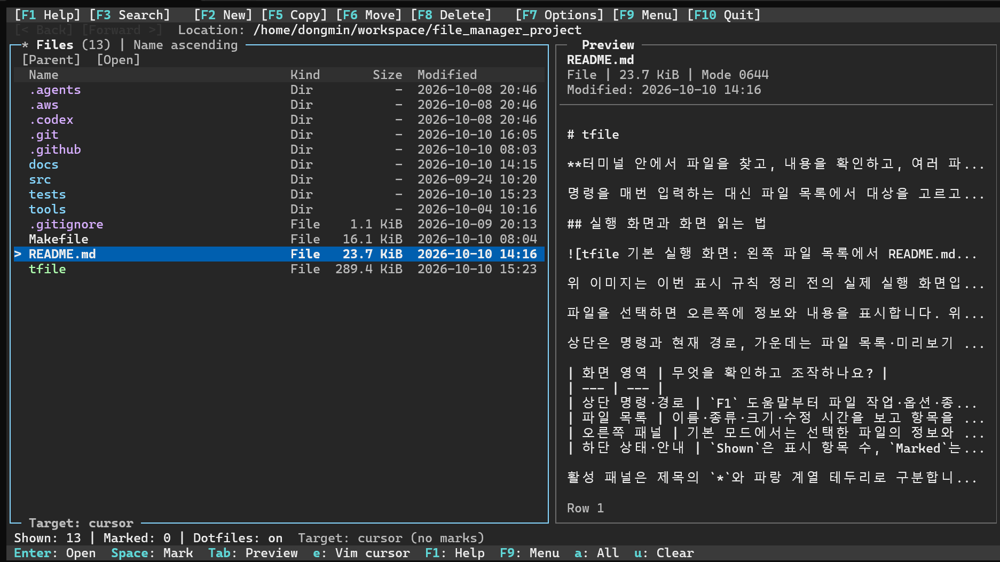

# tfile

**터미널 안에서 파일을 찾고, 내용을 확인하고, 여러 파일을 복사·이동하는 파일 관리자입니다.** C11과 ncursesw로 구현했으며 Linux/WSL 환경을 대상으로 합니다.

명령을 매번 입력하는 대신 파일 목록에서 대상을 고르고 키보드나 마우스로 작업합니다. 기본 화면에서는 **파일 목록과 미리보기**를 함께 보고, 파일을 정리할 때는 **두 디렉터리를 나란히 열어** 원본과 목적지를 오갈 수 있습니다. 텍스트는 바로 미리 볼 수 있고, 이미지·PDF는 터미널과 선택 도구의 지원이 필요합니다.

## 실행 화면과 화면 읽는 법



파일을 선택하면 오른쪽에 정보와 내용을 표시합니다. 위 실제 실행 화면에서는 왼쪽 파일 목록에 초점이 있고, 하단에서 표시 항목 수·마킹 수·숨김 표시 설정과 기본 조작 키를 확인할 수 있습니다.

상단은 명령과 현재 경로, 가운데는 파일 목록·미리보기 또는 두 파일 목록, 하단은 상태·작업 결과·현재 초점의 단축키로 구성됩니다.

| 화면 영역 | 무엇을 확인하고 조작하나요? |
| --- | --- |
| 상단 명령·경로 | `F1` 도움말부터 파일 작업·옵션·종료까지 접근하고 현재 디렉터리를 확인합니다. |
| 파일 목록 | 이름·종류·크기·수정 시간을 보고 항목을 선택합니다. `>`는 커서, 항목의 `*`는 파일 작업 대상으로 마킹한 상태입니다. |
| 오른쪽 패널 | 기본 모드에서는 선택한 파일의 정보와 내용을 미리 봅니다. 이중 패널 모드에서는 별도의 디렉터리를 탐색합니다. |
| 하단 상태·안내 | `Shown`은 표시 항목 수, `Marked`는 마킹 수, `Dotfiles`는 숨김 파일 표시 설정입니다. 작업 결과와 현재 사용할 수 있는 키도 표시합니다. |

활성 패널은 제목의 `*`와 강조 테두리로 구분합니다. **현재 커서가 가리키는 파일과 작업 대상으로 마킹한 파일은 다릅니다.** 마킹이 있으면 마킹한 항목들에 작업하고, 없으면 커서 항목 하나에 작업합니다.

## 어떤 작업에 쓰나요?

| 하고 싶은 일 | tfile에서의 흐름 |
| --- | --- |
| 파일을 찾아 내용 확인하기 | 디렉터리를 탐색하거나 이름을 검색한 뒤, 선택한 파일을 미리보기에서 읽습니다. |
| 여러 파일을 다른 폴더로 정리하기 | 원본에서 `Space`로 마킹 → 반대편 목록에서 목적지 열기 → 원본에서 `F5` 복사 또는 `F6` 이동 → 대상·목적지 확인 → `!`로 결과 확인 |
| 목록을 보기 편하게 바꾸기 | `F7`에서 정렬·숨김 표시 등을 바꾸고, 필요하면 다음 실행의 기본값으로 명시적으로 저장합니다. |

**프로젝트 구성:** `src/ui/`는 화면과 입력, `src/core/`는 탐색·검색·파일 작업 정책, `src/platform/`은 운영체제의 파일 접근과 외부 변환을 담당합니다. 의존 방향은 **UI → core → platform**이며, 검사 코드는 `tests/`, 상세 설계와 검증 기록은 `docs/`에 있습니다. [구조와 검증](#구조와-검증)에서 구현 책임과 검사 방법을 설명합니다.

처음 실행하려면 [빠른 시작](#빠른-시작), 실제 조작은 [기본 사용법](#기본-사용법)을 따라가세요. 삭제는 영구 삭제이고 작업 취소가 이미 완료한 변경을 되돌리지는 않으므로 [파일 작업 주의사항](#파일-작업-주의사항)도 확인하세요.

[주요 기능](#주요-기능) · [빠른 시작](#빠른-시작) · [기본 사용법](#기본-사용법) · [미리보기와 제한](#미리보기와-제한) · [파일 작업 주의사항](#파일-작업-주의사항) · [구조와 검증](#구조와-검증) · [문서와 라이선스](#문서와-라이선스)

## 주요 기능

- **탐색과 검색:** 디렉터리 이동과 방문 위치 복원, 현재 목록 빠른 찾기, 하위 디렉터리의 파일 이름 검색을 제공합니다. 검색은 파일 내용 검색이 아닙니다.
- **이중 패널:** 좌우 목록에서 경로·정렬·숨김 표시·마킹을 독립적으로 관리하고, 반대편 디렉터리를 복사·이동 목적지로 사용할 수 있습니다.
- **파일 정리:** 여러 항목을 마킹해 복사·이동·영구 삭제하고, 파일·디렉터리 생성과 단일 이름 변경을 수행합니다. 작업별 결과와 목록 갱신 오류는 따로 확인할 수 있습니다.
- **미리보기:** 텍스트를 스크롤해 읽고, 조건을 갖춘 터미널에서는 PNG/JPEG와 PDF 첫 페이지를 확인합니다. 파일 편집이나 외부 뷰어 실행은 제공하지 않습니다.
- **설정:** 화면 모드, 정렬, 숨김 표시, 휠 이동량과 이미지 Auto/Off를 변경하고 시작 기본값으로 저장할 수 있습니다.

## 빠른 시작

필수 의존성은 **C11 컴파일러, make, ncursesw 개발 라이브러리**입니다. 실행에는 대화형 터미널과 유효한 `TERM`/terminfo가 필요하며 UTF-8 로캘을 권장합니다.

Ubuntu 24.04에서 빌드·PTY 실행을 검증했습니다. 아래 패키지 명령은 해당 환경의 의존성과 대조한 설치 예시이며, 새 OS에서 패키지 설치부터 검증한 것은 아닙니다. 다른 Linux 배포판과 실제 WSL의 호환성 검증 범위는 [환경 기록](docs/RELEASE_READINESS_2026-10-08.md)을 참고하세요.

```sh
sudo apt update
sudo apt install git build-essential libncurses-dev
git clone https://github.com/DongminKang0919/terminal-file-manager.git
cd terminal-file-manager
make
./tfile
```

저장소가 이미 있다면 해당 디렉터리에서 `make`부터 실행하세요. 위 내려받기 명령에는 `git`이 필요합니다. 실행 파일은 저장소의 `tfile`이며 `make install`은 제공하지 않습니다.

```sh
./tfile /path/to/directory  # 시작 디렉터리 지정; 생략하면 현재 디렉터리
```

실행 인자는 시작 디렉터리 하나입니다. 일반 실행에 개발용 환경변수나 사전 이미지 진단은 필요하지 않습니다. 입출력 리다이렉션, 누락된 `TERM`, `TERM=dumb`는 오류로 종료합니다. 최소 화면은 **50열 × 9행**, 권장 화면은 **100열 × 24행**이며 더 작은 화면에서는 크기 안내를 표시합니다.

이미지·PDF가 필요할 때만 선택 도구를 설치하세요. 도구가 없어도 탐색·텍스트 미리보기·파일 작업은 사용할 수 있습니다.

```sh
sudo apt install imagemagick poppler-utils
```

## 기본 사용법

다음 키는 메인 화면의 파일 목록을 기준으로 합니다.

| 키 | 동작 |
| --- | --- |
| `↑` / `↓`, `k` / `j` | 커서 이동 |
| `Enter` / `→`, `Backspace` / `←` | 디렉터리 열기 / 상위 디렉터리 이동 |
| `[` / `]`, `Alt+←` / `Alt+→` | 이전 / 다음 방문 위치 |
| `Ctrl+F`, `F3` / `/` | 현재 목록 빠른 찾기 / 하위 디렉터리 이름 검색 |
| `Space` | 커서 항목의 마킹 켜기·끄기 |
| `F2`, `F5` / `F6`, `F8` / `Delete` | 생성, 복사 / 이동, 영구 삭제 확인 |
| `Tab` / `Shift+Tab` | 조작 가능한 미리보기 또는 좌우 목록으로 초점 이동 |
| `!`, `r` | 최근 작업 결과 상세 / 새로고침 |
| `F7`, `F9` / `m` | 옵션 / 전체 메뉴 |
| `F1` / `?`, `q` / `F10` | 도움말 / 종료 |

**탐색 → 마킹 → 복사·이동 → 결과 확인:** 원본 디렉터리에서 `Space`로 대상을 마킹합니다. `>`는 커서, 항목의 `*`는 마킹이며 `Marked`는 작업 대상 수입니다. 마킹이 없으면 커서 항목 하나가 대상이고, 다른 디렉터리로 이동하면 기존 마킹은 해제됩니다.

`F9` → **View: Left + Right files**를 선택하고 `Tab`으로 반대편 목록에 이동해 목적지 디렉터리를 엽니다. 원본 목록으로 돌아와 `F5` 또는 `F6`을 누르면 반대편 디렉터리가 목적지로 제안됩니다. 한 항목은 **Copy now / Move now**, 여러 항목은 목적지 입력 후 확인창의 **Execute**로 실행합니다. 기본 목적지만으로 자동 실행하지 않으며 실제 목적지를 확인하거나 수정할 수 있습니다. 상대 경로는 폼의 원본 **Base** 기준입니다. 작업 후 `!`에서 대상별 결과를 확인하세요.

마우스는 클릭으로 항목 선택·패널 활성화, 더블클릭으로 디렉터리 열기·파일 미리보기, 휠로 목록 이동·미리보기 스크롤을 수행합니다. 이중 모드는 80열 미만에서 활성 목록만 보여주지만 `Tab` 전환과 반대편 목적지 규칙은 유지됩니다. 미리보기는 스크롤할 내용이 있을 때만 초점을 받고 `Esc`로 목록에 돌아옵니다.

팝업에서는 `Tab`/`Shift+Tab`으로 조작 요소를 이동하고 `Enter`로 실행합니다. `Esc`는 닫기 또는 취소이며 검색 중에는 수집한 결과를 남깁니다. 리사이즈는 팝업을 닫고 진행 작업에 취소를 요청합니다. 전체 단축키와 임시 디렉터리 연습 예시는 [상세 사용 안내](docs/USER_GUIDE.md#기본-사용)와 `F1` 도움말을 참고하세요.

`F7`의 **Save current settings as startup defaults**를 선택해야 다음 실행에 설정이 저장됩니다. 종료 시 자동 저장하지 않습니다. 기본 경로는 `$XDG_CONFIG_HOME/tfile/settings.conf` 또는 `$HOME/.config/tfile/settings.conf`이며, 잘못된 기존 설정은 경고하고 기본값으로 실행합니다. 경로·마킹·방문 기록·터미널 감지 결과는 저장하지 않습니다. [설정 저장 규칙](docs/USER_GUIDE.md#사용자-설정-저장)에 경로 조건과 기존 파일 교체 정책을 설명합니다.

## 미리보기와 제한

| 대상 | 지원 범위와 조건 |
| --- | --- |
| 텍스트 | 외부 도구 없이 페이지 단위 읽기·스크롤. 긴 줄을 나누고 제어문자를 이스케이프하며, 바이너리 본문은 표시하지 않음 |
| PNG/JPEG | Sixel 터미널과 셀 픽셀 크기 확인, ImageMagick의 `magick` 또는 `convert` 및 필요한 PNG/JPEG/SIXEL coder |
| PDF | 첫 페이지 이미지: 위 이미지 조건 + Poppler `pdftoppm`. 이미지 사용 불가 시 첫 페이지 텍스트: `pdftotext` |


PNG를 선택한 실제 실행 화면입니다. 파일 정보 아래에 이미지를 원본 비율로 표시하며, 이미지 자체에 스크롤 조작이 없으면 파일 목록에 초점을 유지합니다.

기본 **Auto**는 최초 미디어 표시가 필요할 때 Sixel 지원과 셀 픽셀 크기를 자동 조회합니다. `F7` → **Image display setup**은 감지 실패 복구와 실제 표시·지우기 확인용 수동 진단입니다. 자동 응답이나 PTY 검사는 실제 픽셀 표시·잔상 확인을 대신하지 않습니다.

이미지는 메타데이터 아래 영역에 원본 비율을 유지해 중앙 배치하고 작은 래스터는 확대하지 않습니다. 검증한 `xterm-256color` 설정에서는 같은 이미지의 상태 안내나 이미지 표시 행에 영향 없는 마킹 변경 시 불필요한 지우기·재전송을 줄입니다. 화면 배치 변경과 모달 복귀에는 안전한 재출력을 유지합니다. 입력은 **64 MiB**, 이미지 출력은 **1536×1152 픽셀 / 2 MiB**, PDF 텍스트 출력은 **64 KiB**, 변환은 **8초**로 제한하며 변환 프로세스의 메모리도 제한합니다. PDF 페이지 이동·확대/축소와 tmux/screen 그래픽 passthrough는 제공하지 않습니다.

도구 누락, 터미널 무응답·미지원, Off, 변환 실패는 안내로 구분하고 파일 관리는 계속할 수 있습니다. PDF는 이미지 기능이 꺼져 있거나 지원·도구 조건을 충족하지 못하면 텍스트를 시도합니다. 모든 변환 오류가 텍스트로 대체되는 것은 아니며, 손상·암호화 문서나 텍스트 추출 실패는 오류·상태를 표시합니다. 스캔 PDF의 OCR은 제공하지 않습니다. [미디어 상세 안내](docs/USER_GUIDE.md#선택적-이미지pdf-미리보기-1단계)를 참고하세요.

이미지 감지·표시·복구의 자세한 절차는 [상세 사용 안내](docs/USER_GUIDE.md)에 있습니다.

## 외부 편집기·뷰어

F9 → **Edit in editor** / **Open externally**는 마킹과 별개로 현재 커서의 일반 파일 하나를 대상으로 합니다. Enter의 기존 탐색·미리보기 동작은 유지합니다. 편집기는 비어 있지 않은 VISUAL → EDITOR → 사용 가능한 vi 순으로 선택합니다. 설정은 공백으로 인수를 나누고 single/double quotes 및 backslash로 묶거나 이스케이프할 수 있습니다. 셸 확장·명령 치환·파이프·리다이렉션은 실행하지 않으며, 따옴표 밖의 셸 연산자는 거부합니다. 파일 경로는 별도의 절대 경로 argv 인자로 추가하므로 선행 `-`·공백·특수문자를 보존합니다.

편집기가 돌아오면 화면·입력·커서 항목과 목록/미리보기를 갱신합니다. 도구 실패도 표시하며 사용자 편집기에 변환기 시간·메모리 제한이나 강제 종료 정책을 적용하지 않습니다. GUI 연결은 xdg-open(필수 도구 xdg-utils)을 사용하며, 요청 반환 성공은 실제 문서 표시·저장 완료를 뜻하지 않습니다. 링크·디렉터리·특수 파일은 이번 연결 대상에서 제외합니다. 커서 파일을 명령으로 직접 실행하는 기능은 없습니다.

## 현재 목록 필터

`f` 또는 F9 → Filter / Clear current list에서 이름 부분 일치(ASCII 대소문자 무시) 또는 전체 이름 glob(대소문자 구분, `* ? []`와 backslash escape)을 선택합니다. `f` → Clear로 해제합니다. 재귀 검색(F3)·현재 목록 빠른 찾기(Ctrl+F)와 별개이며 패널마다 독립적입니다. 필터 적용·해제 시 모든 마킹을 해제하고 안내하므로 보이지 않는 항목을 일괄 작업에 포함하지 않습니다. 필터는 정렬·숨김 설정, 디렉터리 이동·새로고침·방문 기록 복원에 유지됩니다. 검색 결과를 직접 열 때에는 해당 패널의 필터를 해제해 결과를 표시합니다. 활성 필터와 결과 없음은 화면에서 표시합니다.

## 즐겨찾기

`b` 또는 F9 → Favorite directories에서 현재 활성 패널의 디렉터리를 등록(`a`), 이름 변경(`r`), 등록 해제(`d`)하고 Enter로 이동합니다. 기존 방문 기록과 연결되며 등록 해제는 실제 디렉터리를 삭제하지 않습니다. 시작 설정과 별도 `favorites.conf`에 저장하므로 즐겨찾기 변경으로 현재 설정이 저장되지 않습니다. 최대 64개, 이름 128바이트이며 접근·저장 오류는 표시하고 기존 상태를 유지합니다. 잘못된 저장 파일은 자동 덮어쓰지 않습니다.

## 파일 작업 주의사항

- **삭제는 휴지통 없는 영구 삭제**입니다. 디렉터리 내부도 삭제하며 링크 대상은 따라가지 않습니다. 확인창은 **Cancel**이 기본 선택입니다.
- 기존 대상을 덮어쓰거나 디렉터리를 병합하지 않습니다. 이름 충돌은 오류이며 자동 이름 변경이나 자기 내부로의 전송도 지원하지 않습니다.
- 이동은 같은 파일시스템에서만 지원합니다. 교차 파일시스템 이동을 복사 후 삭제로 자동 대체하지 않습니다.
- 이동·이름 변경은 원본과 목적지 부모 디렉터리를 FD로 고정합니다. 고정 후 부모 경로 교체로 다른 디렉터리에 접근하지 않지만, 최종 원본 항목 교체까지 원자적으로 막지는 않습니다. [방어 범위와 회귀 검증](docs/PARENT_MOVE_REVIEW_2026-10-09.md)을 참고하세요.
- 일괄 작업은 현재 목록 순서로 처리하고 복사·이동의 변경 없는 이름 충돌에는 Stop / Skip this target / Skip all later name collisions를 제공합니다. 다른 실패·취소 및 이미 부분 복사된 항목의 충돌은 중단합니다. 성공 대상은 마킹을 해제하고 건너뜀·실패·취소·미실행 대상은 목록에 남아 있으면 유지합니다.
- **실패·취소는 완료한 변경을 롤백하지 않습니다.** 불완전한 복사와 잔여 파일이 남을 수 있고 자동 정리·재시도는 없습니다. 삭제한 항목도 복원하지 않습니다. 취소는 현재 파일시스템 호출이 끝나야 반영되며, 이동은 개별 호출 도중 취소할 수 없습니다.
- `!`에서 부분 처리와 미실행 대상을 확인하세요. 작업 결과와 목록 갱신 실패는 별도로 기록합니다. `z`는 알림만 닫고 상세는 보존합니다.

상세한 대상 고정·목적지 검증·취소 규칙은 [파일 작업 안내](docs/USER_GUIDE.md#복사이동삭제)에 있습니다.

## 구조와 검증

의존 방향은 **UI → core → platform**입니다. 입력과 표시를 작업 정책 및 운영체제 접근에서 분리하며, [계층 검사](tests/check_architecture.py)로 의존 규칙을 확인합니다.

| 경로 | 책임 |
| --- | --- |
| `src/ui/` | ncursesw 렌더링, 키보드·마우스 입력, 패널·팝업·진행·결과 표시 |
| `src/core/` | 탐색·정렬·선택·검색·미리보기, 단일·일괄 작업 정책과 결과 집계, 터미널 응답 검증 |
| `src/platform/` | POSIX 파일시스템·설정 입출력, 외부 변환 프로세스와 터미널 접근 |
| `src/model.h`, `src/model.c` | 공통 데이터 모델과 수명 관리 |
| `tests/` | native 단위·회귀 검사, PTY 상호작용 검사, sanitizer와 계측 도구 |

검사 도구에는 Python 3가 추가로 필요합니다. 다음 명령은 저장소 루트에서 실행합니다.

```sh
make                      # 제품 빌드
make -j4 check            # 임시 HOME/XDG와 TFILE_* 격리 환경의 일반 검사
python3 tests/isolated_check.py python3 tests/run_sanitizers.py \
  --output-directory /tmp/tfile-sanitizers-readme
```

sanitizer 스크립트는 별도 바이너리를 빌드하고 기본으로 ASan/UBSan/LSan을 요청합니다. 출력 디렉터리의 개별 로그를 확인하세요. `--disable-leaks` 결과는 누수 검사 통과가 아니며, ptrace 등 환경 제약으로 LSan이 실행되지 못하면 누수 검사는 미완료입니다. 미디어·터미널 전용 sanitizer 명령은 [상세 검증 안내](docs/USER_GUIDE.md#검증)에 있습니다.

**명령 제공과 검사 통과 기록은 구분합니다.** 2026-10-08 [설치·사용 점검](docs/RELEASE_READINESS_2026-10-08.md)은 빌드·일반 검사와 실제 미디어 변환 결과를 기록합니다. 이후 사용자 수동 LSan에서 발견한 설정 경로 누수는 테스트의 `ui_free()` 누락을 수정했고, [후속 소유권 검증](docs/SETTINGS_OWNERSHIP_VALIDATION_2026-10-08.md)은 수정 후 기본 sanitizer 17개와 일반 검사 통과를 기록합니다. 이는 해당 검사 범위의 결과이며 모든 제품 흐름·미디어 전용 검사·환경의 누수 부재를 보장하지 않습니다. 이번 README 편집에서는 제품 테스트를 재실행하지 않았습니다.

## 문서와 라이선스

- [상세 사용 안내](docs/USER_GUIDE.md): 전체 조작·설정·미디어 진단·검사 방법
- [설계 참고서](docs/REFERENCE.md): 작업 정책과 구현 구조
- [UI/UX 검증](docs/UI_UX_VALIDATION.md), [이중 패널 검증](docs/PANELS_VALIDATION.md), [전송 검증](docs/TRANSFER_VALIDATION.md), [일괄 작업 검증](docs/BATCH_VALIDATION.md)
- [이미지 재출력 측정·개선](docs/MEDIA_REDRAW_VALIDATION_2026-10-09.md)
- [이미지 자동 감지 검증](docs/IMAGE_AUTO_VALIDATION_2026-10-04.md), [이미지/PDF 검증](docs/MEDIA_PREVIEW_VALIDATION.md)
- [안정화·계측 기록](docs/STABILIZATION_2026-10-03.md), [연속 사용 점검](docs/STABILIZATION_2026-10-04.md): 개발 과정, 재현 조건과 측정 범위

저장소에 `LICENSE` 파일이 없어 명시된 배포·재사용 라이선스가 없습니다.
