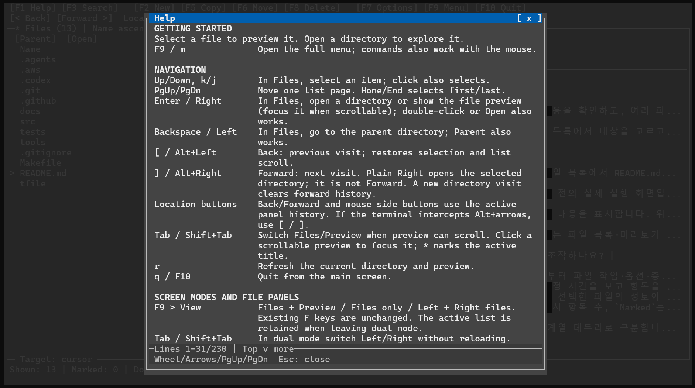

# tfile

**명령어가 아직 낯선 사람도 터미널에서 파일을 쉽게 찾고 정리할 수 있도록 만든 파일 관리자입니다.** C11과 ncursesw로 구현했으며 Linux/WSL 환경을 대상으로 합니다.

리눅스와 터미널을 처음 사용할 때는 폴더를 오가거나 파일을 복사하는 일에도 명령어와 경로를 알아야 합니다. tfile은 “초보 사용자도 파일 관리를 수월하게 할 수 있으면 어떨까?” 하는 마음에서 시작했습니다. 파일 목록과 미리보기를 보며 대상을 고르고, 화면의 메뉴와 키보드·마우스로 작업할 수 있습니다.


왼쪽은 파일 목록, 오른쪽은 미리보기입니다. 상단에는 현재 경로와 명령, 하단에는 작업 대상과 사용할 수 있는 키가 표시됩니다.

[빠른 시작](#빠른-시작) · [첫 사용 연습](#처음-사용하는-분께) · [기본 조작](#기본-사용법) · [제한과 주의사항](#파일-작업-주의사항) · [설계와 검사](#구조와-검증)

## 빠른 시작

필수 의존성은 **C11 컴파일러, make, ncursesw 개발 라이브러리**입니다. Ubuntu 24.04 및 WSL의 Ubuntu에서 사용할 설치 예시는 다음과 같습니다. 새 환경에서의 설치부터 전체 검증한 결과는 아니며, 확인한 환경과 검사 범위는 [아래 검증 안내](#검증-범위)에 구분했습니다.

```sh
sudo apt update
sudo apt install git build-essential libncurses-dev
git clone https://github.com/DongminKang0919/terminal-file-manager.git
cd terminal-file-manager
make
./tfile
```

저장소가 이미 있다면 해당 디렉터리에서 `make`부터 실행하세요. 실행 파일은 저장소의 `tfile`이며 `make install`은 제공하지 않습니다.

```sh
./tfile /path/to/directory  # 생략하면 현재 디렉터리에서 시작
```

대화형 터미널, 유효한 `TERM`/terminfo가 필요하며 UTF-8 로캘을 권장합니다. 최소 화면은 **50열 × 9행**, 권장 화면은 **100열 × 24행**입니다.

**선택 의존성:** Vim 편집은 `vim`, 외부 뷰어 열기는 `xdg-utils`, 이미지·PDF 미리보기는 `imagemagick`·`poppler-utils`를 사용합니다. 필요한 도구만 설치하세요. **선택 도구가 없어도 탐색·텍스트 미리보기·파일 작업은 가능합니다.**

```sh
sudo apt install vim xdg-utils imagemagick poppler-utils
```

## 처음 사용하는 분께

저장소 루트에서 아래 명령을 실행하면 임시 연습 폴더에 예제 파일과 복사 목적지를 만들고 tfile을 엽니다.

```sh
practice_dir=$(mktemp -d /tmp/tfile-practice.XXXXXX)
mkdir "$practice_dir/destination"
printf 'Hello, tfile!\n' > "$practice_dir/hello.txt"
./tfile "$practice_dir"
```

연습은 목록+미리보기 화면 기준입니다. 다른 화면으로 시작하면 `F9`에서 **View: Files + Preview**를 선택하세요.

1. **탐색:** `↑` / `↓`로 `hello.txt`를 선택해 오른쪽 내용을 확인합니다. `destination`을 선택하고 `Enter`로 연 뒤, `Backspace`로 돌아옵니다.
2. **복사:** `hello.txt`를 선택하고 `F5`를 누릅니다. **To** 입력란에 `destination`을 입력하고 `Enter`를 누릅니다. **Name**은 `hello.txt`로 두고 다시 `Enter`를 눌러 **Copy now** 버튼으로 이동합니다. **Target**이 연습 폴더의 `destination/hello.txt`인지 확인하고 `Enter`로 실행합니다.
3. **결과 확인:** `!`로 최근 작업 결과를 읽고 `Esc`로 닫습니다. `destination` 폴더를 열어 복사된 파일을 확인합니다.
4. **종료:** 메인 화면에서 `q` 또는 `F10`을 누릅니다. 연습 폴더와 파일은 종료 후에도 `/tmp`에 남습니다.

단축키를 한꺼번에 외울 필요는 없습니다. **`F1` 도움말**, **`F9` 전체 메뉴**에서 필요한 조작을 찾아보세요. 도움말은 방향키·페이지 키·휠로 읽고 `Esc`로 닫습니다.



## 주요 기능

- **찾고 확인하기:** 폴더 탐색·방문 기록, 현재 목록 빠른 찾기·필터, 하위 폴더의 파일 이름 검색, 텍스트·이미지·PDF 미리보기.
- **파일 정리하기:** 생성·단일 이름 변경, 마킹한 여러 항목의 복사·이동·휴지통 이동·영구 삭제, 대상별 작업 결과 확인.
- **작업 공간 바꾸기:** 목록+미리보기 또는 좌우 파일 목록, 정렬·숨김 표시 설정, 즐겨찾기, 외부 Vim·뷰어 연동.

## 기본 사용법

다음 키는 파일 목록에 초점이 있을 때를 기준으로 합니다. 마우스 클릭으로 선택하고, 더블클릭으로 폴더를 열거나 파일을 미리 보고, 휠로 스크롤할 수도 있습니다.

| 키 | 동작 |
| --- | --- |
| `↑` / `↓` | 커서 이동 |
| `Enter` / `→`, `Backspace` / `←` | 폴더 열기 / 상위 폴더 이동 |
| `[` / `]` (또는 `Alt+←` / `Alt+→`) | 방문 기록 뒤로 / 앞으로 |
| `Space`, `a` / `u` | 커서 항목 마킹 전환, 보이는 항목 전체 마킹 / 해제 |
| `Ctrl+F`, `F3` | 현재 목록 빠른 찾기 / 하위 폴더 이름 검색 (내용 검색 아님) |
| `F2`, `F5` / `F6` | 생성, 복사 / 이동 |
| `t`, `F8` / `Delete` | 휴지통 이동 / 영구 삭제 확인 |
| `Tab` | 조작 가능한 미리보기 또는 반대편 목록으로 초점 이동 |
| `e`, `b`, `f` | Vim 편집, 즐겨찾기, 현재 목록 필터 |
| `!`, `r`, `F7` | 최근 작업 결과, 새로고침, 옵션 |
| `F1` / `?`, `F9` / `m`, `q` / `F10` | 도움말, 전체 메뉴, 종료 |

**커서와 마킹:** `>`는 현재 커서, 항목의 `*`는 `Space`로 표시한 작업 대상입니다. 마킹이 있으면 활성 패널의 마킹한 항목들에 작업하며, 마킹이 하나여도 커서보다 우선합니다. 마킹이 없으면 커서 항목 하나가 대상입니다. **`e`/Vim은 예외로 항상 커서의 텍스트 파일 하나를 편집합니다.** 하단의 `Marked`와 `Target` 안내로 대상을 확인하세요.

**방문 기록과 상위 폴더:** `[` / `]`는 실제 방문한 위치를 오갑니다. `Backspace` / `←`는 현재 위치의 상위 폴더로 이동합니다. `→`는 선택한 폴더를 엽니다.

**여러 파일 정리:** `F9` → **View: Left + Right files**로 바꾸고 원본 목록에서 `Space`로 대상을 마킹합니다. `Tab`으로 반대편 목록에 가서 목적지 폴더를 연 뒤 원본으로 돌아와 `F5` 또는 `F6`을 누릅니다. 제안된 목적지와 대상을 확인해 실행하고, `!`로 결과를 읽습니다.

팝업에서는 `Tab`/`Shift+Tab`으로 조작 요소를 이동하고 `Enter`로 실행하며 `Esc`로 닫거나 취소합니다. 설정·필터·편집의 세부 규칙은 [기본 조작](docs/USER_GUIDE.md#기본-사용), [파일 작업](docs/USER_GUIDE.md#다중-선택과-파일-작업), [설정 저장](docs/USER_GUIDE.md#사용자-설정-저장), [Vim·외부 열기](docs/USER_GUIDE.md#vim-편집과-외부-열기)를 참고하세요.

## 미리보기와 제한

| 대상 | 지원 범위와 필요한 도구 |
| --- | --- |
| 텍스트 | 외부 도구 없이 읽기·스크롤. 바이너리 본문은 표시하지 않음 |
| PNG/JPEG | Sixel을 지원하는 터미널 + ImageMagick의 `magick` 또는 `convert` (PNG/JPEG/SIXEL coder 필요) |
| PDF | **첫 페이지** 이미지: 위 조건 + Poppler `pdftoppm`. 이미지 사용 불가 시 `pdftotext`로 첫 페이지 텍스트를 시도 |


이미지 표시는 터미널 기능과 셀 픽셀 크기 확인이 필요하며 기본 **Auto**에서 감지합니다. 표시가 안 되거나 잔상이 생기면 `F7` → **Image display setup**으로 진단하고 [미디어 상세 안내](docs/USER_GUIDE.md#선택적-이미지pdf-미리보기-1단계)를 확인하세요.

PDF 페이지 이동·확대/축소·OCR, tmux/screen 그래픽 passthrough는 제공하지 않습니다. 손상·암호화 문서 등 모든 변환 실패가 텍스트로 대체되지는 않습니다. 문서 전체를 읽을 때는 F9의 **Open externally**로 외부 뷰어를 사용할 수 있습니다.

## 파일 작업 주의사항

- **휴지통과 영구 삭제:** `t`는 휴지통 이동, `F8`/Delete는 복원할 수 없는 영구 삭제입니다. 영구 삭제는 폴더 내부도 삭제합니다. 두 확인창 모두 **Cancel**이 기본이며, 휴지통 실패를 영구 삭제로 대체하지 않습니다. 앱 안의 휴지통 복원은 제공하지 않으며 데스크톱 도구를 사용합니다. 휴지통은 지원하는 로컬 POSIX 파일시스템에서 사용하고 원격·DrvFS 등은 거부합니다.
- **덮어쓰기와 이동 제한:** 기존 파일 덮어쓰기·폴더 병합·자동 이름 변경·자기 내부로의 전송은 지원하지 않습니다. 이동은 같은 파일시스템에서만 가능하며, 교차 파일시스템 이동을 복사 후 삭제로 대체하지 않습니다.
- **취소와 부분 실패:** 완료한 변경은 되돌리지 않습니다. 불완전한 복사와 잔여 파일이 남을 수 있으며 자동 정리·재시도는 없습니다. 삭제된 항목도 복원하지 않습니다. 취소는 현재 파일시스템 호출이 끝나야 반영되며 개별 이동 호출 도중에는 취소할 수 없습니다.
- **결과 확인:** 일괄 복사·이동의 변경 없는 이름 충돌은 건너뛸 수 있지만 다른 실패·취소는 작업을 중단합니다. `!`에서 성공·건너뜀·실패·취소·미실행 대상과 목록 갱신 오류를 확인하고 남은 파일을 판단하세요.

상세 정책은 [복사·이동·삭제 안내](docs/USER_GUIDE.md#복사이동삭제)와 [안전 정책](docs/USER_GUIDE.md#안전-정책과-제한)에 있습니다.

## 구조와 검증

### 주요 설계 결정

- **화면과 작업 정책 분리:** 터미널 입력·표시가 파일 작업 정책과 섞이지 않도록 **UI → core → platform**으로 나눴습니다. UI는 입력·렌더링, core는 상태·작업 정책, platform은 운영체제 접근을 맡아 작업 로직을 ncurses와 독립적으로 검사합니다. [코드 구조](docs/USER_GUIDE.md#코드-구조)
- **부분 처리 결과 보존:** 여러 파일 작업은 도중에 실패하거나 취소될 수 있으므로 완료한 변경을 유지하고 대상별 결과를 기록합니다. 자동 롤백을 제공하지 않아 사용자가 `!`에서 부분 처리와 미실행 대상을 확인해야 합니다. [결과 안내](docs/USER_GUIDE.md#알림과-최근-결과)
- **터미널 상호작용과 메모리 검사:** 입력·화면 복원 오류와 메모리 문제를 확인하기 위해 PTY 회귀 검사와 ASan/UBSan/LSan을 사용합니다. PTY는 실제 픽셀 표시·잔상을 입증하지 않으며 sanitizer 결과도 실행한 경로와 환경에 한정됩니다. [검사 방법](docs/USER_GUIDE.md#검증)

검사에는 Python 3가 추가로 필요합니다. 저장소 루트에서 실행합니다.

```sh
make                 # 제품 빌드
make -j4 check       # 임시 HOME/XDG 환경의 단위·회귀·PTY·계층·문서 검사
make check-docs      # 주요 문서의 상대 링크와 제목 anchor 검사
```

[Linux CI](.github/workflows/linux.yml)는 Ubuntu 24.04에서 GCC/Clang 빌드·첫 실행·회귀 검사와 별도 sanitizer 작업을 실행하도록 구성되어 있습니다. CI 구성과 실제 통과 기록은 구분하며, sanitizer 명령·환경 제약·터미널 idle 검사 기록은 [개발·검증 문서 안내](docs/README.md#개발검증-기록)에서 확인할 수 있습니다.

### 검증 범위

| 구분 | 확인한 범위와 근거 |
| --- | --- |
| 자동 작업 환경 | Ubuntu 24.04.5에서 GCC 빌드·전체 회귀·PTY·ASan/UBSan 검사 결과를 기록했습니다. 해당 실행의 LSan은 미완료입니다. [2026-10-10 기록](docs/RELEASE_READINESS_2026-10-10.md#직접-검증) |
| 개발자의 실제 WSL 사용·수동 검사 | 개발자는 WSL Ubuntu에서 사용하고 수동 검사 결과를 전달했습니다. 당시 native 17개와 미디어 native·PTY의 ASan/UBSan/LSan 완료·누수 미검출을 로그 검토로 확인했습니다. [수동 결과](docs/MEDIA_PREVIEW_VALIDATION.md#수정-후-사용자-wsl-터미널의-수동-sanitizer-결과-검토) |
| 아직 확인하지 않은 범위 | 다른 배포판, 모든 터미널·폰트·SSH/multiplexer 조합, 최신 커밋 전체의 WSL 재검증은 확인되지 않았습니다. 스크린샷과 과거 PASS는 모든 환경·기능의 보증이 아닙니다. |

과거 WSL 수동 산출물 일부는 커밋 해시·전체 환경 정보가 없어 정확한 버전의 증명이 아니며 최신 전체 검사 통과로 확대하지 않습니다. [버전 확인 한계](docs/STABILIZATION_2026-10-04.md#기존-수동-누수-검사-산출물-재검토)를 참고하세요.

## 상세 문서

- **사용자 안내:** [USER_GUIDE](docs/USER_GUIDE.md) — 전체 조작·설정·미디어 진단, [REFERENCE](docs/REFERENCE.md) — 상세 동작·제한과 구현 참고.
- **개발·검증 기록:** [문서 안내](docs/README.md) — 배포 준비, UI·파일 작업·미디어·안정화 기록을 주제별로 정리했습니다.

## 라이선스

저장소에 `LICENSE` 파일이 없어 명시된 배포·재사용 라이선스가 없습니다.
